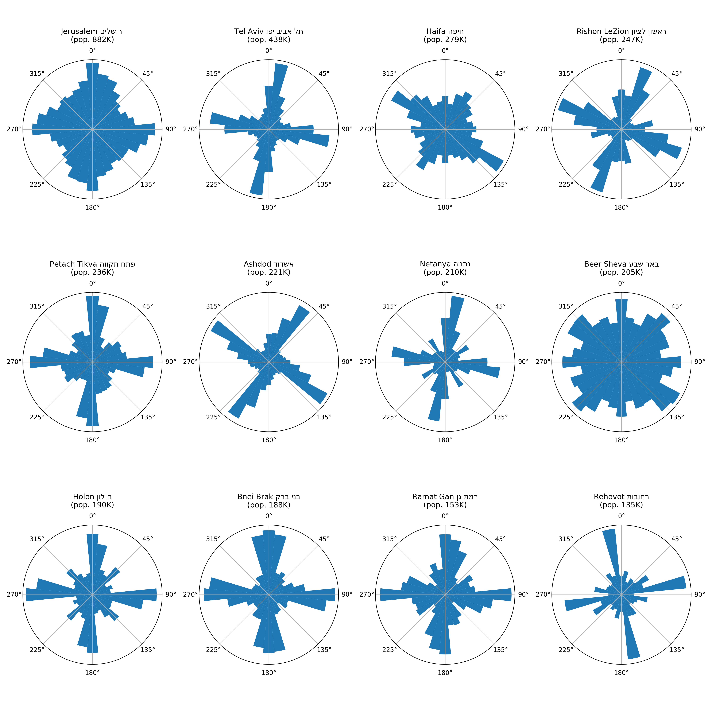

ביולי 2018
נתקלתי
ב[פוסט][2]
של
Geoff Boeing
שמפתח את ספריית 
[OSMnx][1]
לניתוח מידע קרטוגרפי.
 הוא תיאר שימוש בספריה כדי ליצור תרשים שמתאר את התפלגות הכיוונים של רחובות בערים שונות בעולם.

[1]: https://github.com/gboeing/osmnx
[2]: https://geoffboeing.com/2018/07/comparing-city-street-orientations/

השתמשתי בקוד שלו (בשיפורים קלים) והפעלתי אותו על 12 הערים הגדולות בישראל (לפי ויקיפדיה). הנה התוצאה:

<figure>
  
  <figcaption>אוריינטציה של רחובות ב- 12 הערים הגדולות בישראל</figcaption>
</figure>

הקוד שמייצר את התרשים נמצא ברשיון MIT ב- [GitHub][3].

[3]: https://github.com/dubek/israel-cities-street-orientation
