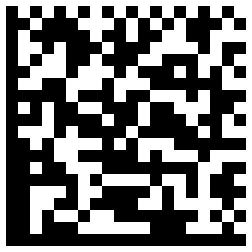

*עדכון מה- 13/2/2019: משרד הפנים הודיע שיוריד את מספר הזהות מהברקוד; ראו תגובה בסוף.*

באוקטובר 2018 קיבלתי בתיבת הדואר גלויה ממשרד הפנים להצבעה לרשויות המקומיות.
הגלויה כמובן מוענה אלי (כלומר הכילה את שמי וכתובתי) וכן ציינה את מיקום הקלפי בו הייתי אמור להצביע ביום הבחירות.
אלה כמובן פיסות מידע גלויות לכל מי שמציץ בכל מכתב שמונח בתיבת הדואר שלי.

אבל, בצד השני של הגלויה מודפס בר-קוד קטן.
הבר-קוד הדו-ממדי הזה הוא בפורמט
[Data&nbsp;Matrix][1]
&mdash;
שיטה לקידוד מחרוזת של מספרים או אותיות
&mdash;
שבדרך-כלל משמשת לצרכי משלוח 
(למשל, כדי לקודד את המיקוד של היעד עבור שמכונה שממיינת דואר).

[1]: https://en.wikipedia.org/wiki/Data_Matrix

<figure>
  
  <figcaption>דוגמה לקוד בפורמט Data Matrix</figcaption>
</figure>

מה מכיל הבר-קוד שעל גלויית ההצבעה?
צילמתי את גלויית ההצבעה שקיבלתי, 
הזנתי את התמונה ל[אתר שמפענח בר-קודים][2],
בחרתי ברשימת הפורמטים את Data&nbsp;Matrix,
ולחצתי על Read&nbsp;Barcode.
תוך זמן קצר התוכנה זיהתה  את הבר-קוד בקצה התמונה והציגה את הספרות המקודדות בו. 
(יש גם אפליקציות לטלפון שמאפשרות לצלם בר-קוד כזה ומיד להציג את המידע המקודד בו.)

[2]: https://demo.dynamsoft.com/DBR/BarcodeReaderDemo.aspx

## מה מקודד בבר-קוד?

 הבר-קוד שעל גלויות ההצבעה מכיל 35 ספרות: 9 הראשונות הן מספר תעודת הזהות, 7 הבאות הן המיקוד, 
 ואחריהן עוד 19 ספרות שלא הצלחתי למצוא את פירושן. 

## אוקיי, אז מה?

כל מי שיש לו גישה לתיבת הדואר שלי לפני שהספקתי לאסוף את הגלויה, יוכל לצלם אותה ולקבל בקלות את מספר תעודת הזהות שלי. שימו לב שבפרטים המודפסים משרד הפנים לא כלל את מספר תעודת הזהות, בדיוק כדי שהדוור/ת וכל מי שמציץ בתיבה שלי לא יוכל לראות בקלות את מספר תעודת הזהות שלי.

בנוסף, אנשים תמימים צילמו את עצמם עם הגלויה ופרסמו ברשתות החברתיות. הם זכרו לצנזר (בעזרת מלבנים שחורים או "סטיקרים") פרטים רגישים כמו כתובת מדויקת, אבל לא מחקו את הבר-קוד. כל אחד שרואה את התמונה יכול לסרוק את הקוד ולקבל את מספר תעודת הזהות שלהם ומיקוד ב- 7 ספרות (שנותן את מיקום הבית ברמה של חלק קטן של רחוב).

באופן יותר כללי, אני ממליץ לא להפיץ תמונות שכוללות בר-קוד כזה. לא ברור האם מקודד בבר-קוד כזה מידע אישי שלא היינו רוצים להפיץ (מספר תעודת זהות / דרכון / טלפון / חשבון בנק). אם אתם רוצים להפיץ צילום שמכיל בר-קוד, צנזרו את כולו, בדיוק כמו שאתם מצנזרים פרטים אישיים שמופיעים בתמונה באותיות שאנשים יודעים לקרוא.

## תגובת משרד הפנים

ממרכזת פניות הציבור במשרד הפנים נמסר:

> שלום רב, \
> לאחר בדיקה מול אגף הפיקוח על הבחירות הריני להשיבך: \
> אנו בודקים אפשרויות טיפול בסוגיה. \
> מודים על הפניית תשומת הלב.

אני מקווה שמשרד הפנים ישכיל להסיר את הבר-קוד כולו מגלויות ההצבעה עוד לפני הבחירות הקרובות באפריל 2019.

## עדכון: תגובה נוספת ממשרד הפנים ב- 13/2/2019

ב- 13/2/2019 קיבלתי אימייל נוסף מדוברות משרד הפנים:

> להלן תגובת משרד הפנים בנוגע לבר-קוד על גלויות הבוחר:
>
> משרד הפנים פעל להסרת מספר הזהות מהבר קוד.
>
> הבר קוד שיופיע לא יכיל זיהוי ויופיע רק לטובת מעקב אחר דואר חוזר.

כל הכבוד!
